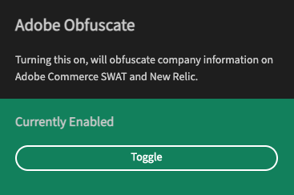

# Adobe Obfuscate Chrome Extension

A basic chrome extension which injects CSS into various Adobe tools to obfuscate :see_no_evil: customer specific information.

This is useful for demoing of tools, or otherwise taking screenshots of pages that you want to hide some of the customer information from.

## Installation

Download the [obfuscate-adobe.zip file](/jasonfordAdobe/obfuscate-chrome-extension/releases), and use [Load Unpacked](https://webkul.com/blog/how-to-install-the-unpacked-extension-in-chrome/) within Chrome to load the plugin.

## What you get

-   A Chrome extension that can be installed to the browser
    -   Simple on/off switch
    -   Enabled/Disabled indicator
-   Works with the following tools:
    -   Adobe Site Wide Analysis
    -   New Relic One

## How is this made

This project is made using the setup provided by [abstractalgo/react-browser-extension](https://github.com/abstractalgo/react-browser-extension)

And makese use of:

-   [React](https://github.com/facebook/react)
-   [Tyepscript](https://github.com/microsoft/TypeScript)
-   [SASS](https://github.com/sass/sass)
-   [Adobe React Spectrum](https://github.com/adobe/react-spectrum)

## Further Development

To do list:

-   Test further scenarios
-   Improve build script and GitHub deployment

## Getting Help

This Chrome extension was built for specific uses and is _not_ supported by Adobe. To get support for this, or to raise a future development request. Please create a detailed GitHub issue that provides as much detail as possible.
